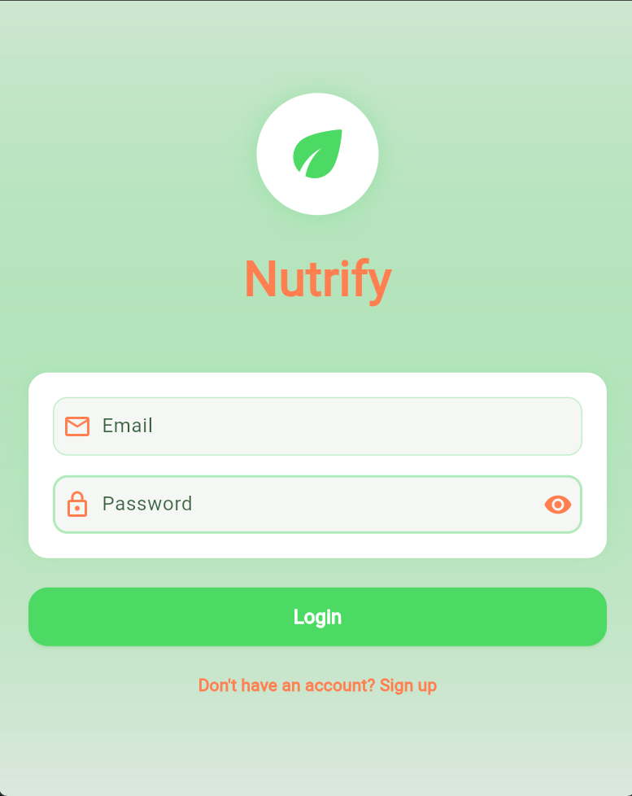
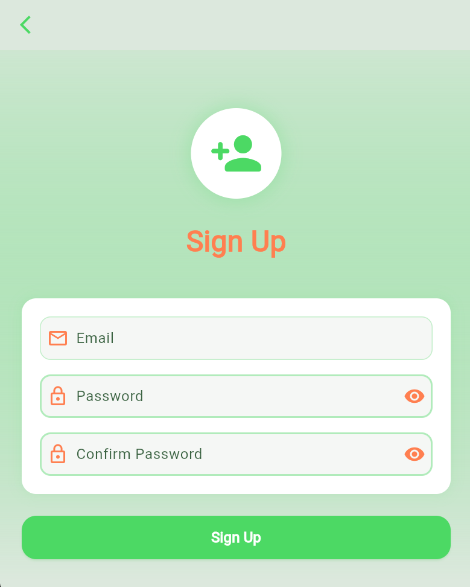
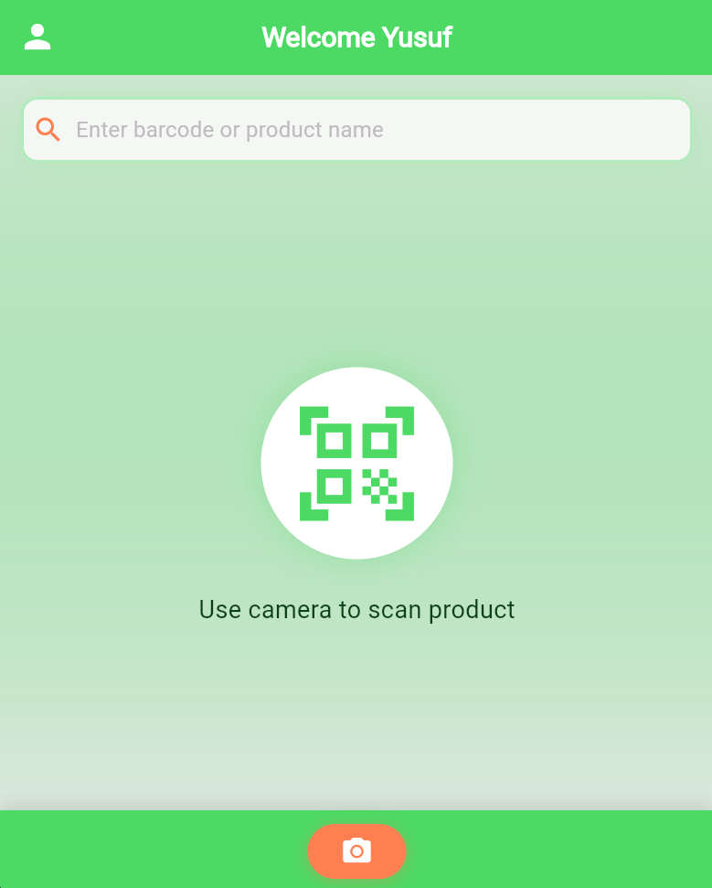
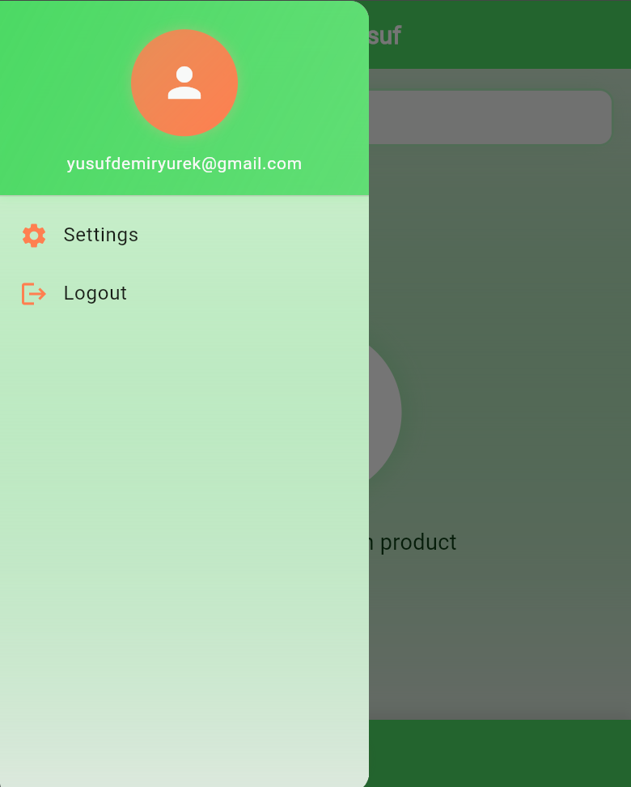
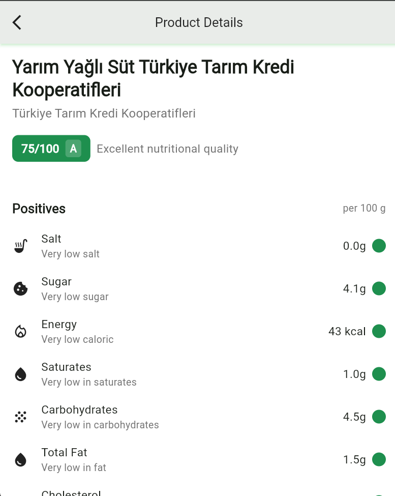
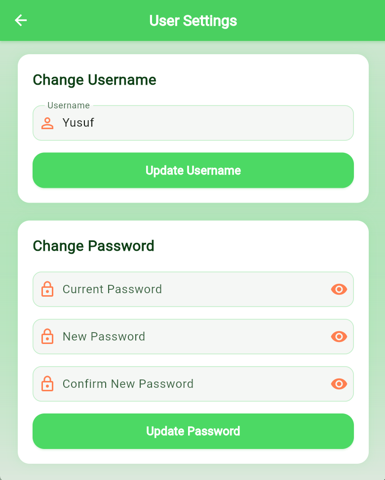
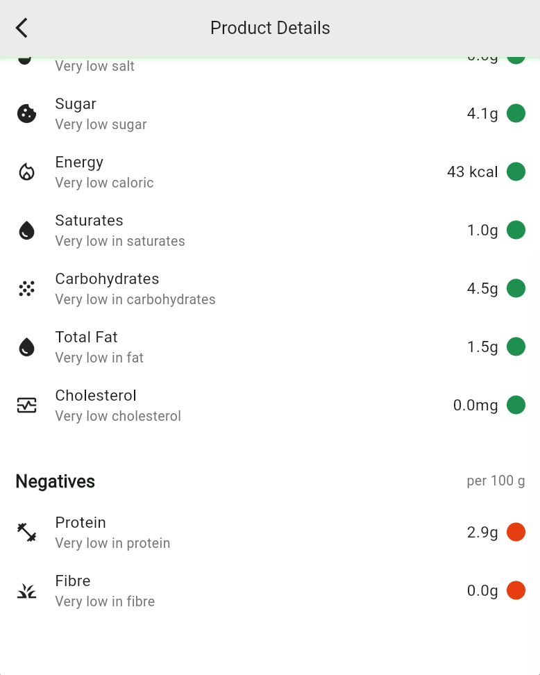

# Nutrify - Food Nutrition Analysis App 🥗

<p align="center">
  
</p>

Nutrify is a modern Flutter application that helps users make informed food choices by providing detailed nutritional analysis of food products through barcode scanning. Using the Nutri-Score system, it evaluates and grades products from A to E based on their nutritional quality.

## 🎥 Demo

<div align="center">
  
[](https://www.youtube.com/embed/sj1hk2sSqSs?autoplay=1&mute=1 "Watch Nutrify Demo")

</div>

## ✨ Features

### 🔍 Real-time Barcode Scanning
- Quick and accurate barcode scanning using the device's camera
- Real-time product information retrieval
- Efficient caching system for previously scanned products

### 📊 Comprehensive Nutritional Analysis
- Detailed breakdown of nutritional values
- Four-level evaluation system with color indicators:
  - Dark Green: Very Good
  - Light Green: Good
  - Yellow: Bad
  - Red: Very Bad
- Analysis of key nutrients including:
  - Protein
  - Carbohydrates
  - Fats
  - Fiber
  - Sugar
  - Salt
  - Calories

### 🏆 Nutri-Score Rating
- Products are rated from A to E
- Score calculation based on:
  - Nutritional quality (per 100g)
  - Protein content
  - Fiber content
  - Sugar levels
  - Salt content
  - Saturated fats

### ⚠️ Allergen Information
- Clear display of allergen warnings
- Dietary information for various food preferences
- Comprehensive ingredient analysis

## 🛠️ Technical Features

- **Firebase Integration**: Real-time data storage and retrieval
- **Web Scraping**: Automated nutrition fact extraction from reliable sources
- **State Management**: Implemented using Riverpod
- **Clean Architecture**: Following SOLID principles
- **Responsive UI**: Modern and user-friendly interface

## 🚀 Getting Started

### Prerequisites
- Flutter SDK (^3.5.3)
- Firebase account
- Android Studio / VS Code

### Installation

1. Clone the repository
```bash
git clone https://github.com/boyraz-cmj/nutrify.git
```

2. Install dependencies
```bash
flutter pub get
```

3. Configure Firebase
- Add your `google-services.json` for Android
- Add your `GoogleService-Info.plist` for iOS

4. Run the app
```bash
flutter run
```

## 📱 Screenshots

[Screenshots Coming Soon]

## 🔧 Built With

- [Flutter](https://flutter.dev/) - UI framework
- [Firebase](https://firebase.google.com/) - Backend services
- [Riverpod](https://riverpod.dev/) - State management
- [Mobile Scanner](https://pub.dev/packages/mobile_scanner) - Barcode scanning
- [Cloud Firestore](https://firebase.google.com/products/firestore) - Database
- [Firebase Auth](https://firebase.google.com/products/auth) - Authentication

## 📦 Dependencies

- flutter_riverpod: ^2.3.6
- hooks_riverpod: ^2.3.6
- mobile_scanner: ^3.5.6
- cloud_firestore: ^4.14.0
- firebase_auth: ^4.16.0
- http: ^0.13.5
- freezed_annotation: ^2.4.1
- riverpod_annotation: ^2.3.3

## 👥 Contributors

- Yusuf Emre Boyraz - Initial work & Development
- Yusuf Baki Demiryürek 
- Semih Kaan Duran

## 📄 License

This project is licensed under the MIT License - see the [LICENSE](LICENSE) file for details.

## 🙏 Acknowledgments

- Inspired by Yuka app's nutrition scoring system
- Special thanks to the Flutter and Firebase communities

## Screenshots from the Nutrify Project

<div style="display: flex; flex-wrap: wrap; gap: 10px; justify-content: center;">









</div>
